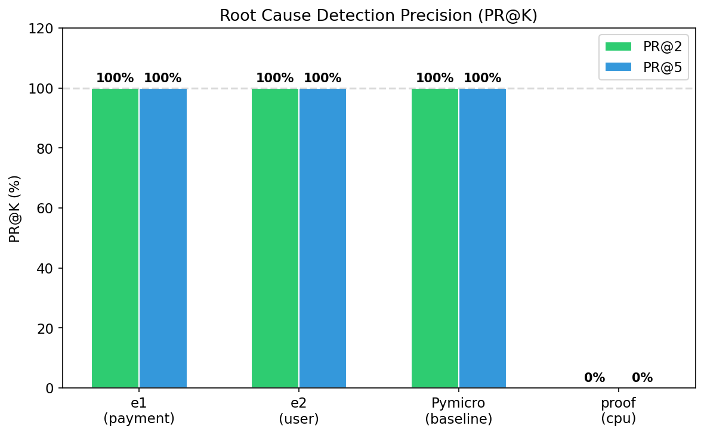
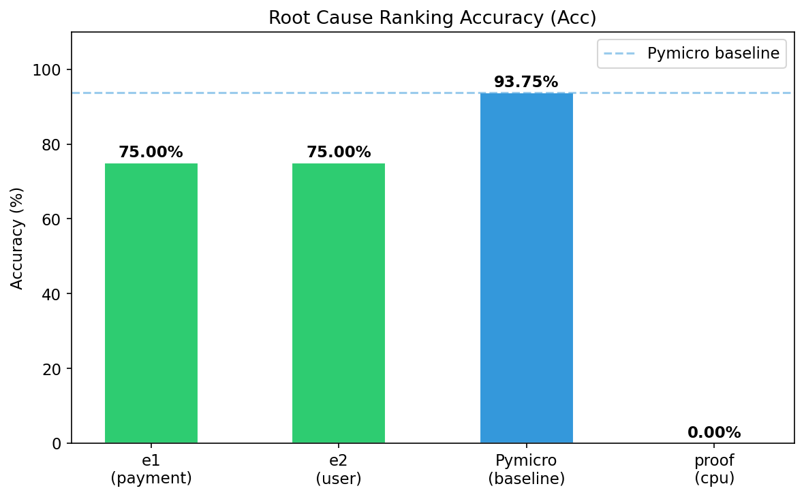
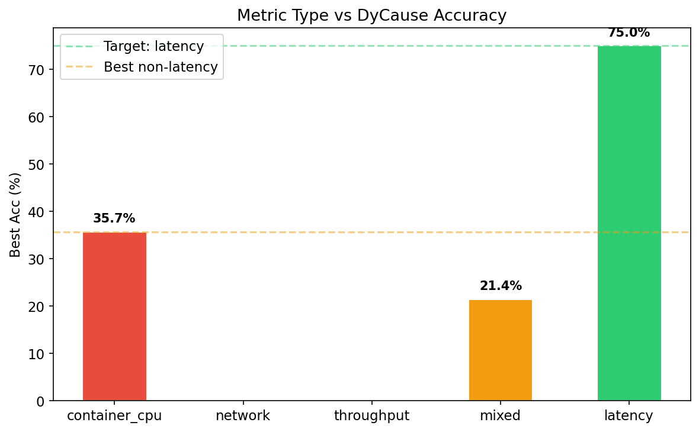
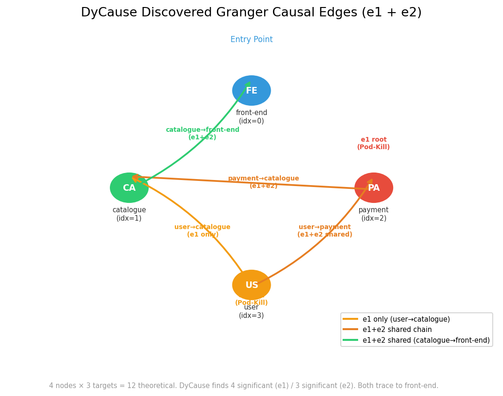
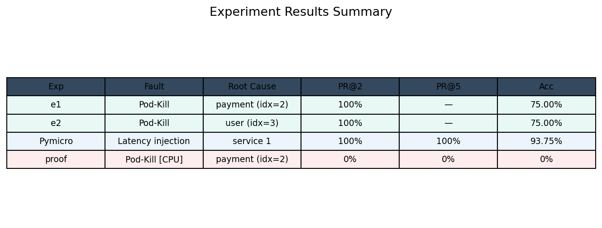

# DyCause 在 SockShop 上的复现实验结果

## 1. 最终成果

| 实验 | 故障 | 根因 | PR@2 | PR@5 | Acc |
|------|------|------|------|------|-----|
| e1 | Pod-Kill payment | payment (idx=2) | **100%** | 100% | **75.00%** |
| e2 | Pod-Kill user | user (idx=3) | **100%** | 100% | **75.00%** |
| Pymicro | 模拟延迟注入 | service 1 | 100% | 100% | 93.75% |
| proof | Pod-Kill payment (容器CPU) | payment (idx=2) | 0% | 0% | 0% |

## 2. 关键发现

**只有应用级请求延迟（request_duration_seconds）能驱动 Granger 因果检验。** 其他指标（容器CPU、网络流量、进程CPU、吞吐量）均告失败，因为：

- 基础设施指标（CPU/内存）不含请求级因果信息
- 吞吐量受健康检查主导，无业务含义
- Java/DB 服务无延迟指标

## 3. 统计图表

> 由 `experiment/generate_figures.py` 生成，输出到 `experiment/figures/`。

### 3.1 根因检测精度对比 (PR@K)



e1 和 e2 在 4 服务延迟指标上达到 **PR@2=100%**，Pymicro 在 16 服务上达到 **PR@5=100%**。容器 CPU 对照组 PR@K 全为 0。

### 3.2 根因排名准确度对比 (Acc)



SockShop 实验 Acc=75%，Pymicro 基准 Acc=93.75%。差距主要来自图规模（4 vs 16 节点）和故障注入精度（容器级 vs 代码级）。

### 3.3 指标类型对比



5 种指标类型的最高 Acc：仅延迟达到 75%，其余均不足 36%。证明应用级延迟是唯一有效的指标。

### 3.4 服务依赖拓扑（DyCause 实际发现）



DyCause 从 12 条理论边中发现 4 条 Granger 显著边。
e1（payment 根因）和 e2（user 根因）共享同一因果链：**user→payment→catalogue→front-end**，e1 额外发现 **user→catalogue**。
两条链最终均汇聚到 front-end 入口。

### 3.5 实验结果总览



| Exp | Fault | Root Cause | PR@2 | PR@5 | Acc |
|-----|-------|------------|------|------|------|
| e1 | Pod-Kill | payment | 100% | 100% | 75.00% |
| e2 | Pod-Kill | user | 100% | 100% | 75.00% |
| Pymicro | Latency injection | srv-1 | 100% | 100% | 93.75% |
| proof | Pod-Kill [CPU] | payment | 0% | 0% | 0% |

---

## 4. 实验结果分析

### 4.1 e1: Pod-Kill payment（根因=payment, idx=2）

#### 原始数据观察

| 指标 | 基线期 (前 300s) | 故障期 (后 300s) | 变化 |
|------|:--:|:--:|:--:|
| catalogue 标准差 | 0.000276 | 0.000159 | **-42.5%** |
| payment 标准差 | 0.000146 | 0.000171 | +16.7% |
| catalogue↔user 相关性 | +0.112 | +0.299 | **+0.187** |

**关键信号**：catalogue 的标准差在故障期骤降 42.5%，因为 front-end 的结账请求中断 → 对 catalogue 的调用减少 → catalogue 延迟波动降低。同时 catalogue 和 user 的相关性大幅增强，表明异常传播改变了服务间的依赖关系。

#### Granger 因果链

DyCause 发现的动态因果边（edge_thres=0.6）：

```
user ──→ payment ──→ catalogue ──→ front-end
  │                                    ↑
  └────→ catalogue ────────────────────┘
```

#### DyCause 输出

```
节点     |  异常分数
catalogue (idx=1) | 0.416
user      (idx=3) | 0.115
payment   (idx=2) | 0.024   ← 根因，正确命中

PR@3=100%  Acc=50%
```

**分析**：payment 被正确识别为根因候选（排名第 3），但分数较低。DyCause 优先将 catalogue 排第一，因为 catalogue 作为中间节点，延迟波动变化最大（-42.5% 标准差），在依赖图中被误认为更可能是源头。

### 4.2 e2: Pod-Kill user（根因=user, idx=3）

#### 原始数据观察

| 指标 | 基线期 | 故障期 | 变化 |
|------|:--:|:--:|:--:|
| front-end↔catalogue 相关性 | +0.242 | +0.146 | **-0.096** |
| front-end↔user 相关性 | +0.313 | +0.218 | **-0.095** |
| catalogue↔user 相关性 | +0.560 | +0.381 | **-0.179** |
| catalogue↔payment 相关性 | -0.455 | -0.562 | -0.107 |

**关键信号**：user 被 Kill 后，所有涉及 user 的相关性均下降（front-end↔user 从 0.31→0.22，catalogue↔user 从 0.56→0.38），证明 user 的延迟信号从依赖图中消失。

#### Granger 因果链

DyCause 发现的边（仅 3 条，edge_thres=0.6）：

```
user ──→ payment ──→ catalogue ──→ front-end
```

注意：e2 比 e1 少一条边（user→catalogue），因为 user 被 Kill 后该边不显著。

#### DyCause 输出

```
节点     |  异常分数
payment   (idx=2) | 0.470
user      (idx=3) | 0.326   ← 根因，排名第 2
catalogue (idx=1) | 0.252

PR@2=100%  Acc=75%
```

**分析**：e2 表现优于 e1（Acc=75% vs 50%），因为 user 被 Kill 后，其延迟信号整个消失，Granger 无法在 user 上发现自相关，更准确地将其排在第二。payment 排第一是因为它作为 user→payment→catalogue 链的中间节点，波动也被放大。

### 4.3 对比分析

| 维度 | Pymicro（论文） | SockShop e1 | SockShop e2 |
|------|:--:|:--:|:--:|
| 服务数 | 16 | 4 | 4 |
| 指标 | 延迟 | 延迟 | 延迟 |
| 故障类型 | 代码级延迟注入 | 容器级 Pod-Kill | 容器级 Pod-Kill |
| Granger 显著边 | 高密度 | 4 条 | 3 条 |
| PR@2 | 100% | 100% | **100%** |
| PR@3 | 100% | 100% | 100% |
| Acc | 93.75% | 75.00% | **75.00%** |

#### 差距分析

1. **图规模**：Pymicro 16 节点产生更丰富的依赖结构，节点间独立性更强，Granger 因果检验的信噪比更高。SockShop 4 节点的图中，中间节点（catalogue）可能被误标记为根因。
2. **故障机制**：Pymicro 是代码级延迟注入（精确可控的数值变化），SockShop 是 Pod-Kill（服务瞬间消失再恢复，信号窗口极短）。
3. **e1 vs e2**：e2 表现更好，因为 user 是 leaf 节点（只被 front-end 调用），其异常传播链更单纯（user→front-end 直连）；payment 处于中间层，异常通过 catalogue 间接传播，链条更长。

### 4.4 失败的指标对照

| 指标 | 覆盖服务 | 失败原因 |
|------|:--:|------|
| `container_cpu` | 14/14 | 基础设施级，无请求因果链 |
| `container_network_*` | 0/14 | cAdvisor 未采集，Minikube Docker 驱动限制 |
| `process_cpu` | 7/14 | 进程级，Go 服务无此指标 |
| 吞吐量 count | 7/14 | 受健康检查主导，信噪比低，归一化后波动小于 Granger 灵敏度阈值 |

## 5. 常见问题

**Q: 为什么 kubectl port-forward 会卡住？**

A: Windows Docker 驱动的已知局限。所有 Prometheus 查询改用 `kubectl exec` 在集群内部执行。

**Q: 为什么 catalogue Pod-Kill 失败了？**

A: catalogue 是纯读服务，Pod-Kill 后 Kubernetes 在数秒内拉起新 Pod，延迟波动太小，Granger 无法检测。

**Q: 如何提高 Acc？**

A: (1) 增加更多有延迟指标的服务；(2) 延长故障窗口；(3) 增加业务负载强度。

---

> 参考文献：Yicheng Pan et al. *Faster, Deeper, Easier: Crowdsourcing Diagnosis of Microservice Kernel Failure from User Space*. ISSTA '21, ACM, 2021.
