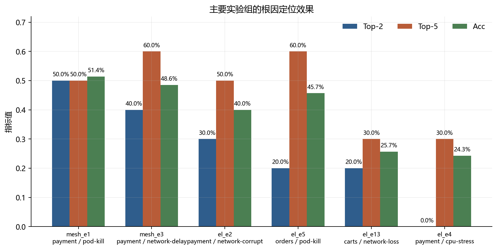
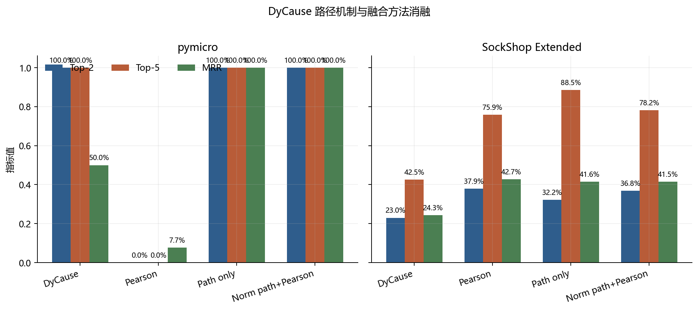

# 基于 SockShop Service Mesh 的 DyCause 根因定位复现实验报告

## 1. 摘要

本文在 SockShop 微服务系统上复现 DyCause 动态因果根因定位方法。实验使用 Istio Service Mesh 采集 7 个 HTTP 服务的请求延迟时间序列，并在 Pod-Kill、NetworkDelay、NetworkLoss、NetworkCorrupt 和 CPUStress 等故障下评估根因排名。当前主线共包含 87 个质量有效 run，DyCause 参数固定为 `lag=7`、`step=30`、`edge_thres=0.8`，窗口为故障前 300s 与故障后 300s。

报告先介绍 DyCause 复现方法和 SockShop 数据结果，再介绍 Pearson、z-shift、path-only 与融合方法等对比实验。结果显示，SockShop 数据质量稳定，但原始 DyCause 在全部有效 run 上的 Top-1、Top-2、Top-5 仅为 13.8%、21.8%、35.6%，平均准确率为 0.310。对比实验进一步表明，DyCause 的 path/backtrace 在 DyCause 原论文开源实验数据 `pymicro` 上有效，但在 SockShop 中呈现稀疏、场景依赖和融合收益有限的特点。

## 2. 复现方法与数据采集

DyCause 原文中与本文复现相关的核心流程是：以服务级时间序列为输入，在滑动窗口内使用 Granger causality 检验服务之间的动态因果关系；将显著关系构造成动态因果图；从异常入口服务执行 backtrace，搜索可能的故障传播路径；最后根据 path candidate 输出根因 ranking。

本文复现沿用这一设置。实验对象为 SockShop 微服务示例系统，观测节点扩展为 7 个 HTTP 服务：`front-end`、`catalogue`、`carts`、`orders`、`payment`、`shipping` 和 `user`。异常入口服务固定为 `front-end`，根因服务使用 DyCause 内部 1-based 编号，例如 `payment=5`、`user=7`。

输入指标为 Istio destination latency，由 `istio_request_duration_milliseconds_sum/count` 转换为秒。输出按 1Hz 采样，每个点由 15s rate window 计算，以降低低流量服务的 NaN 风险。当前主线数据目录为 `data/sockshop_mesh_extended/`，主参数为 `lag=7`、`step=30`、`edge_thres=0.8`。该参数下 87/87 个 run 通过质量检查，DyCause 全部成功运行；最低服务有效率为 97.5%，总缺失点为 44，总零值点为 0。

## 3. 复现数据结果

当前主参数下的总体复现结果如下。全部有效 run 的 Top-1/Top-2/Top-5 为 13.8%/21.8%/35.6%，平均准确率为 0.310，说明 DyCause 在 SockShop 上有局部有效信号，但整体稳定性不足。

| 统计范围 | Runs | Top-1 | Top-2 | Top-5 | Acc Mean |
|---|---:|---:|---:|---:|---:|
| 全部有效 run | 87 | 13.8% | 21.8% | 35.6% | 0.310 |

当前主要正例中，`payment` 相关故障最稳定。`payment` Pod-Kill 在 10 次重复中 Top-1 为 40.0%、Top-2 为 50.0%、Top-5 为 50.0%，平均准确率为 0.514；`payment` NetworkDelay 的 Top-5 达到 60.0%。扩展场景中，`payment` NetworkCorrupt 与 `orders` Pod-Kill 也有一定命中率。相比之下，`payment` CPUStress 和部分 `carts`、`user`、`catalogue` 故障表现较弱。

图 2 表明，不同 root service 和故障类型会显著影响 DyCause 排名效果。Pod-Kill 和 NetworkDelay 更容易产生可回溯信号，而 CPUStress 在当前主参数下几乎无法进入 Top-2。

## 4. 对比实验方法

为判断 DyCause 在 SockShop 上的效果来自哪里，本文设置了若干对比方法。Pearson 入口相关性计算每个服务 latency 与 `front-end` latency 的绝对相关系数，用来检验简单入口相关性是否已经足够。z-shift 均值漂移比较 fault window 与 baseline window 的服务自身异常强度，用来检验 root 自身异常是否比因果路径更稳定。`path_only` 只使用 DyCause backtrace 产生的 path score，用来单独检验路径信号。

此外，本文使用 `path_plus_pearson`、`normalized_path_plus_pearson` 和 `pearson + λ * path` 检验 path signal 与 Pearson 相关性融合时是否存在量纲问题。直接相加用于观察路径分数是否足以改变 Pearson 排序；归一化和 λ 加权用于检查 path score 是否只是被相关性分数淹没。

Path candidate 过滤是对比实验中的关键公平性问题。原始 DyCause 若只输出 path candidate，未进入候选路径的服务会被删掉，root 可能没有排序机会。本文采用全服务 ranking：所有服务都保留在最终 ranking 中，未进入 path candidate 的服务保留为 `path_score=0`。这样，path-only 和融合方法比较的是“路径信号是否有帮助”，而不是把 root 从排名空间中直接移除。

评价指标采用 Top-K 命中率、MRR 与平均准确率。Top-K 衡量真实根因是否出现在前 K 个候选中，MRR 衡量真实根因排名的倒数均值，平均准确率用于保持与 DyCause 输出口径一致。

## 5. 对比实验结果

与简单基线相比，原始 DyCause 在 SockShop Extended 上不占优。87 个 run 中，DyCause 的 Top-2/Top-5 为 21.8%/35.6%；Pearson 入口相关性达到 37.9%/75.9%；z-shift 均值漂移达到 67.8%/90.8%；随机 Top-5 期望为 83.3%。这说明当前 SockShop 数据中，动态因果图和 backtrace 没有稳定转化为更好的精确 ranking；很多故障更接近 root 自身异常强度识别或入口相关性排序问题。

Scoring ablation 表明，DyCause 的 path/backtrace 并非理论上无效。在 DyCause 原论文开源实验数据 `pymicro` 上，Pearson-only 无法命中 root，而 `path_only`、`normalized_path_plus_pearson` 和适度 λ 加权均能把 root 排到 Top-1。相反，在 SockShop Extended 上，`path_only` 的 Top-5 达到 88.5%，但 Top-2 和 MRR 仍低于 Pearson，说明路径信号更像宽召回信号，而不是稳定精排信号。

过滤影响的 case 级证据也支持这一判断。SockShop Extended 中，root 只有 42/87 个 case 出现在 top paths，只有 39/87 个 case 具有非零 path score。全服务 ranking 是必要修正，可以避免 root 被 path candidate 过滤直接删掉；但它不能单独解决 path score 稀疏问题。SockShop 中直接执行 `path + Pearson` 几乎不能改变 Pearson 排序；归一化或 `pearson + λ * path` 可以让路径信号参与排序，但正负 case 会互相抵消，整体收益有限。

## 6. 讨论与结论

DyCause 原论文开源实验数据 `pymicro` 与 SockShop 的差异首先来自数据机制。`pymicro` 是可控延迟注入数据，因果链清晰，root 更容易进入有效 path candidate。SockShop 则包含 Istio latency 指标噪声、低流量窗口、多类故障和真实服务行为差异，服务延迟可能同步波动，但不一定形成稳定的 Granger 方向边。

本文完成了 SockShop + Istio 7 服务 latency 场景下的 DyCause 复现实验。87 个主线 run 均可用于统计。DyCause 能在 `payment` Pod-Kill、`payment` NetworkDelay、`payment` NetworkCorrupt 和 `orders` Pod-Kill 等场景中复现一定的入口回溯能力，但整体低于 Pearson 和 z-shift。主要结论是：DyCause path/backtrace 在原论文开源实验数据 `pymicro` 上有效，在 SockShop 上则是稀疏且场景依赖的信号；保留全服务 ranking 可以修正候选过滤带来的直接删除问题，但后续仍需要更稳健的 path score 构造、归一化和故障类型自适应融合。

威胁有效性主要包括：故障类型和 root 服务分布不完全均衡，`payment` case 占比较高；DyCause 参数采用当前主线最佳实践，尚未按每类故障分别调参；Istio latency 本身包含服务代理和观测窗口带来的噪声。因此，本文结论更适合作为 DyCause 在真实 SockShop mesh latency 数据上的复现与适用性分析，而不是对方法理论上限的最终评判。
